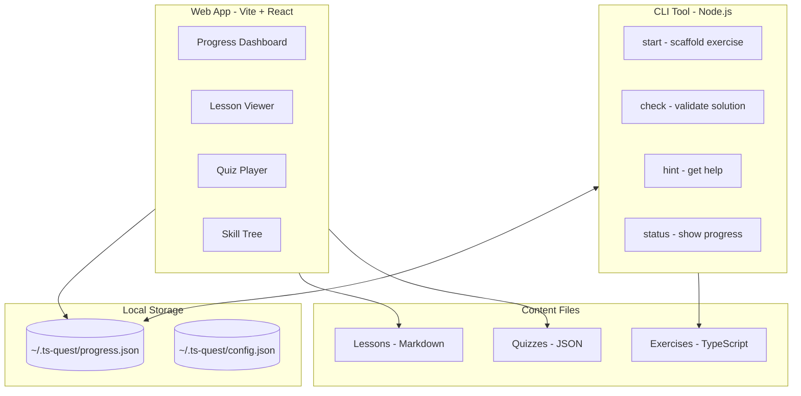
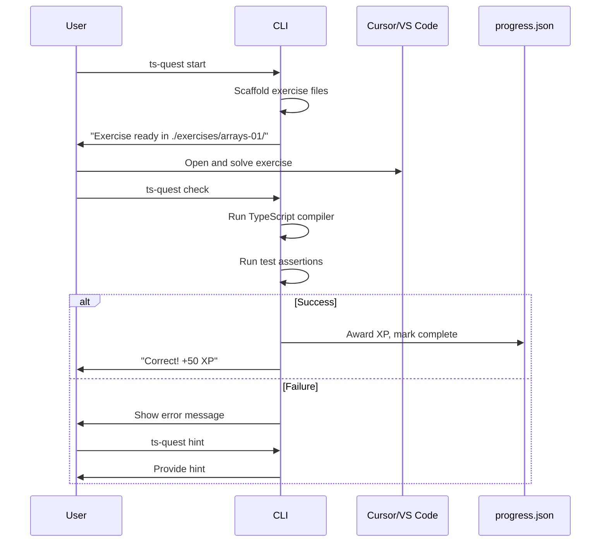

# TypeScript Quest MVP - Simplified Architecture

## Design Philosophy

**Get playing fast.** Every design decision prioritizes speed-to-playable over features:

- Local JSON instead of database
- CLI for coding instead of embedded editor  
- Static/simple web for lessons instead of complex SPA
- Content as markdown files

---

## Architecture



## Tech Stack (Minimal)

| Component | Tech | Why |

|-----------|------|-----|

| CLI | Node.js + Commander | Simple, fast, TypeScript native |

| Web | Vite + React | Fast dev server, simple setup |

| Styling | Tailwind CSS | Quick to style, looks good |

| Content | Markdown + JSON | Easy to author, version control |

| Progress | Local JSON file | Zero dependencies, easy to inspect |

---

## Core Features

### 1. Progress System (JSON-based)

```json
// ~/.ts-quest/progress.json
{
  "profile": {
    "name": "TypeScript Apprentice",
    "level": 3,
    "xp": 1250,
    "xpToNextLevel": 500,
    "currentStreak": 5,
    "longestStreak": 7,
    "lastActiveDate": "2026-01-18"
  },
  "zones": {
    "foundations": { "status": "completed", "progress": 100 },
    "data-structures": { "status": "in-progress", "progress": 60 },
    "narrowing": { "status": "locked", "progress": 0 }
  },
  "topics": {
    "basic-annotations": { "completed": true, "xpEarned": 150 },
    "object-literals": { "completed": true, "xpEarned": 200 },
    "arrays-tuples": { "completed": false, "exercisesCompleted": 3, "exercisesTotal": 8 }
  },
  "achievements": ["first-exercise", "streak-3", "zone-1-complete"],
  "exerciseHistory": [...]
}
```

### 2. CLI Commands

```bash
# Start the game / see status
ts-quest status              # Show XP, level, streak, current topic

# Work on exercises  
ts-quest start               # Start next recommended exercise
ts-quest start arrays-01     # Start specific exercise
ts-quest check               # Validate current exercise solution
ts-quest hint                # Get a hint (costs potential XP)
ts-quest skip                # Skip current exercise

# Navigation
ts-quest topics              # List all topics and their status
ts-quest zones               # Show zone overview with skill tree ASCII

# Web interface
ts-quest web                 # Open web dashboard in browser
```

### 3. Web App Pages

| Page | Purpose |

|------|---------|

| `/` | Dashboard: XP bar, level, streak, current zone progress |

| `/zones` | Visual skill tree of all zones/topics |

| `/learn/:topic` | Lesson content rendered from markdown |

| `/quiz/:topic` | Interactive quiz (multiple choice, type matching) |

| `/achievements` | Badge cabinet showing earned achievements |

### 4. Exercise Flow (Coding Challenges)



---

## Project Structure

```
ts-game/
├── cli/                          # CLI tool
│   ├── src/
│   │   ├── index.ts              # Entry point
│   │   ├── commands/             # Command handlers
│   │   │   ├── start.ts
│   │   │   ├── check.ts
│   │   │   ├── status.ts
│   │   │   └── hint.ts
│   │   ├── lib/
│   │   │   ├── progress.ts       # Read/write progress.json
│   │   │   ├── xp.ts             # XP calculation
│   │   │   └── exercises.ts      # Exercise scaffolding
│   │   └── types.ts
│   └── package.json
│
├── web/                          # Simple web app
│   ├── src/
│   │   ├── App.tsx
│   │   ├── pages/
│   │   │   ├── Dashboard.tsx
│   │   │   ├── Zones.tsx
│   │   │   ├── Lesson.tsx
│   │   │   └── Quiz.tsx
│   │   ├── components/
│   │   │   ├── XPBar.tsx
│   │   │   ├── SkillTree.tsx
│   │   │   └── QuizQuestion.tsx
│   │   └── lib/
│   │       └── progress.ts       # Read progress.json
│   └── package.json
│
├── content/                      # All learning content
│   ├── zones.json                # Zone definitions
│   ├── lessons/                  # Markdown lesson files
│   │   ├── basic-annotations.md
│   │   ├── object-literals.md
│   │   └── ...
│   ├── quizzes/                  # Quiz definitions
│   │   ├── basic-annotations.json
│   │   └── ...
│   └── exercises/                # Coding exercises
│       ├── basic-annotations/
│       │   ├── 01-annotate-params/
│       │   │   ├── exercise.json     # Metadata, hints
│       │   │   ├── starter.ts        # Starting code
│       │   │   ├── solution.ts       # Reference solution
│       │   │   └── test.ts           # Validation tests
│       │   └── 02-return-types/
│       └── ...
│
├── exercises/                    # User's working directory (gitignored)
│   └── current/                  # Current exercise scaffold
│
└── ts-roadmap.md                 # Your existing roadmap
```

---

## Implementation Phases

### Phase 1: Core Infrastructure (Day 1-2)

- Set up CLI project with Commander.js
- Implement progress.json read/write utilities
- Create `status` command showing XP, level, streak
- Define zone and topic data structures

### Phase 2: Exercise Engine (Day 2-3)

- Create exercise JSON schema and 3-4 sample exercises
- Implement `start` command (scaffolds exercise to working directory)
- Implement `check` command (runs TypeScript + tests)
- Implement `hint` command
- XP award logic with bonuses

### Phase 3: Web Dashboard (Day 3-4)

- Set up Vite + React + Tailwind project
- Build dashboard page reading from progress.json
- Build visual skill tree component
- Style with gamified aesthetics

### Phase 4: Lessons and Quizzes (Day 4-5)

- Create lesson markdown structure
- Build lesson viewer page with markdown rendering
- Create quiz JSON schema
- Build quiz player with scoring

### Phase 5: Content Creation (Day 5-7)

- Write lessons for Zone 1 (Foundations)
- Create 5-8 exercises per topic
- Create quizzes for each topic
- Define all achievements

### Phase 6: Polish (Day 7+)

- Add ASCII art and celebrations to CLI
- Add animations to web dashboard
- Streak logic and daily rewards
- Achievement unlock notifications

---

## Key Simplifications from Original Plan

| Original | Simplified |

|----------|------------|

| Supabase database | Local JSON file |

| Monaco code editor | Your actual IDE |

| Complex auth flow | No auth needed |

| Server-side validation | CLI runs TypeScript locally |

| Real-time sync | File-based, instant |

---

## Sample Exercise Format

```json
// content/exercises/basic-annotations/01-annotate-params/exercise.json
{
  "id": "basic-01",
  "title": "Annotate Function Parameters",
  "topic": "basic-annotations",
  "zone": "foundations",
  "difficulty": 1,
  "xpBase": 50,
  "xpBonus": {
    "noHints": 25,
    "fastCompletion": 15
  },
  "description": "Add type annotations to the function parameters so TypeScript knows what types to expect.",
  "hints": [
    "Look at how the function is being called - what values are passed?",
    "The first parameter receives a string, the second receives a number",
    "Use `: string` and `: number` after the parameter names"
  ],
  "timeLimit": 300
}
```

---

## Next Steps

1. Initialize CLI project with TypeScript + Commander
2. Create progress.json structure and read/write utilities  
3. Build `ts-quest status` command as proof of concept
4. Create first exercise and build `start` + `check` flow

This gets you to a playable state in ~1 week instead of 6+ weeks. Ready to build?